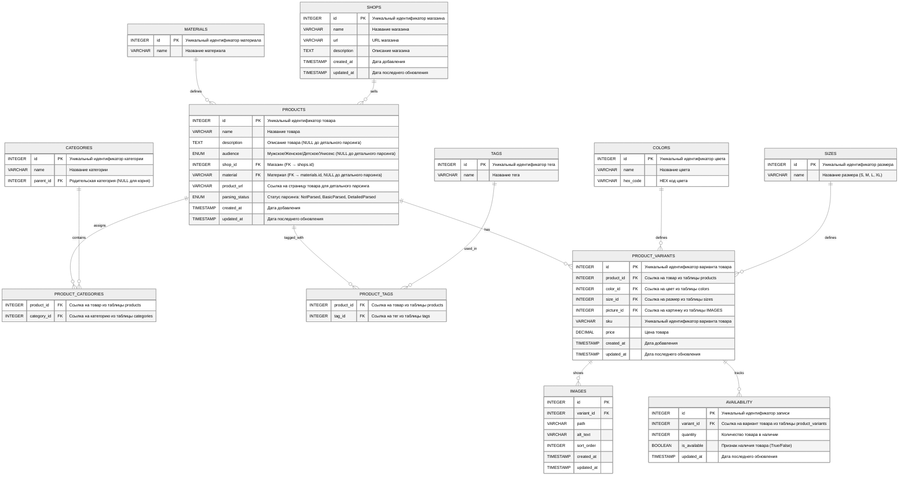

# Mermaid DB structure:
(try at [mermaid.live](https://mermaid.live/) or [mermaidflow.app](https://www.mermaidflow.app/editor))

## Пример записи

**Этап 1 - Базовый парсинг:**
В shops создаём магазин «MyShop» (url = "https://myshop.com").
В products создаём «Пуховик зимний» (name = "Пуховик зимний", shop_id = MyShop.id, product_url = "https://myshop.com/jackets/winter-jacket", parsing_status = BasicParsed).
Поля description, audience, material остаются NULL.

**Этап 2 - Детальный парсинг:**
Обновляем запись: description = "Тёплый зимний пуховик", audience = Unisex, material = «пух/перо», parsing_status = DetailedParsed.
Через product_categories связываем его с категориями «Верхняя одежда» → «Пуховики».
Через product_tags добавляем теги «Лёгкий», «Водонепроницаемый».
В product_variants создаём варианты:

    color = «Чёрный», size = «M», price = 199.99, sku = «JKT-BLK-M»
    color = «Синий», size = «L», price = 199.99, sku = «JKT-BLU-L»

В availability для каждого variant_id указываем quantity и is_available.

## Эта архитектура сочетает:

Строгую иерархию категорий для навигации по дереву.
Гибкие теги для любых дополнительных признаков.
Варианты и наличие для цветов/размеров.
